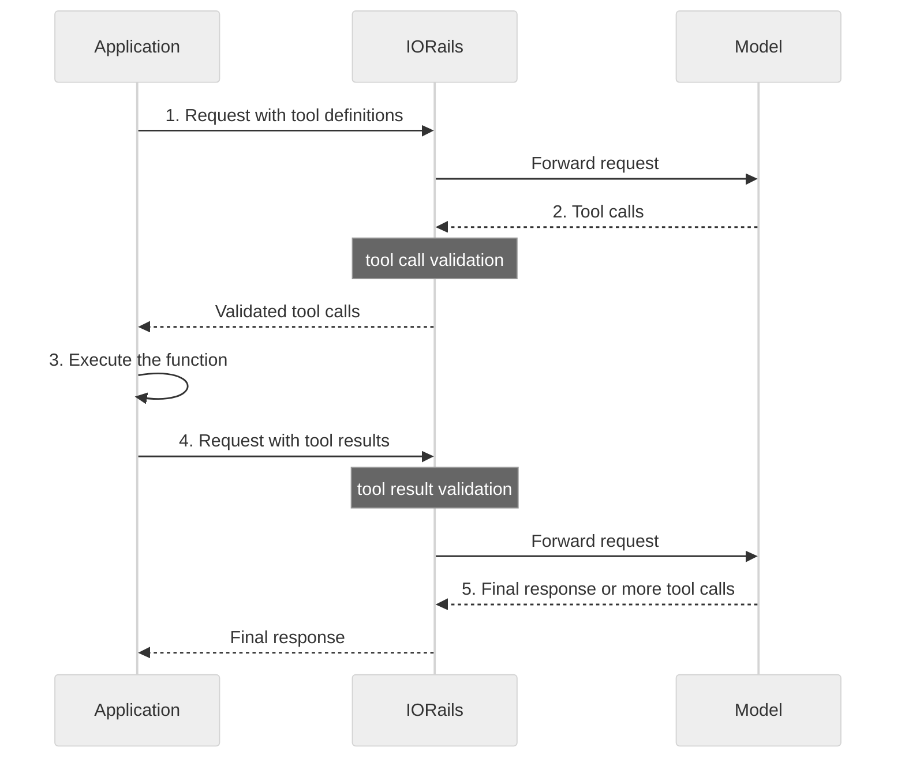

The IORails engine can sit in front of a tool-using chat model and validate tool traffic in both directions.
It forwards your tool definitions to the model unchanged and applies two structural rails:

- **Tool call validation** checks every tool call the model emits against the tools you declared.
  A call must name an allowed tool and supply arguments that satisfy that tool's JSON Schema.
- **Tool result validation** checks the tool results your application returns to the model.
  Each result must link to a tool call the model previously made, name a consistent tool, and carry well-formed content.

Both rails are local checks.
They do not make extra LLM or API calls.
They run on every request and fail closed: a violation, a parsing error, or a malformed payload blocks the request rather than passing it through.

<Note>
    The IORails engine does not execute tools. Your application or agent harness
    executes a tool after the model requests it, then sends the result back on
    the next request. These rails validate the request and response boundary;
    they do not call tools themselves.
</Note>

<Warning>
    Tool-calling rails run only on the IORails engine, which is opt-in and
    experimental. They are not available on the default `LLMRails` engine. See
    [Enable the IORails engine](#enable-the-iorails-engine) below. This feature
    supports only the OpenAI Chat Completions wire format (the `openai` and
    `nim` engines).
</Warning>

## How Function Calling Works

Your application and the model use function calling as a multi-step loop.
Your application, not the model, runs the function.
The flow follows the [OpenAI function-calling guide](https://developers.openai.com/api/docs/guides/function-calling).
During that flow, the IORails rails validate the tool traffic at two points.

A _function_ is a tool you define with a JSON Schema, and _tool_ names the broader category that also covers built-in and custom tools.
When the model decides to use a tool, it returns a _tool call_ identified by a `tool_call_id`, and your application answers it with a _tool result_ that carries the same `tool_call_id`.

The end-to-end flow has five steps:

1. **Make a request to the model with tools it could call.**
   You send the conversation along with your tool definitions.
2. **Receive a tool call from the model.**
   The model responds with one or more tool calls instead of, or alongside, a text answer.
   IORails runs **tool call validation** here, before the tool calls reach your application.
3. **Execute code on the application side with input from the tool call.**
   Your application runs the function and produces a result.
4. **Make a second request to the model with the tool output.**
   You resend the conversation, including the assistant turn that made the calls and one tool result for each `tool_call_id`.
   IORails runs **tool result validation** here, before the model sees the results.
5. **Receive a final response from the model (or more tool calls).**
   The model returns a final text answer, or more tool calls that repeat the loop from step 2.



## How Tool-Calling Rails Fit the Pipeline

Tool-calling rails mirror the input and output rails, with one rail per direction:

| Rail                   | Config section      | Flow name                | Direction     | What it checks                                                                                       |
| ---------------------- | ------------------- | ------------------------ | ------------- | ---------------------------------------------------------------------------------------------------- |
| Tool call validation   | `rails.tool_output` | `tool call validation`   | Model output  | Tool calls the model emits: allowed name plus schema-valid arguments.                                |
| Tool result validation | `rails.tool_input`  | `tool result validation` | Request input | Tool results sent back to the model: linkage to a prior call, name consistency, well-formed content. |

For each request, IORails runs the rails in the following order:

1. **Tool result validation** on the incoming messages (alongside input rails).
2. **Input rails**, then the **main LLM** call.
3. **Tool call validation** on the tool calls the model returned.
4. **Output rails** on the text response.
   A response that contains only tool calls and no text skips the text output rails.

When any rail blocks, IORails returns the refusal message `I'm sorry, I can't respond to that.` for a non-streaming request, and a `guardrails_violation` error payload for a streaming request.

## Enable the IORails Engine

Tool-calling rails require the IORails engine.
Enable it in one of two ways.

Set the `NEMO_GUARDRAILS_IORAILS_ENGINE` environment variable so the top-level `LLMRails` import resolves to the IORails-backed engine.
This is the least invasive option for an existing application or the server:

```console
$ export NEMO_GUARDRAILS_IORAILS_ENGINE=1
```

```python
from nemoguardrails import LLMRails, RailsConfig

config = RailsConfig.from_path("./config")
rails = LLMRails(config)
```

Alternatively, construct the `Guardrails` facade directly, which uses the IORails engine by default:

```python
from nemoguardrails import Guardrails, RailsConfig

config = RailsConfig.from_path("./config")
rails = Guardrails(config)
```

If the configuration is not IORails-compatible, the `Guardrails` facade falls back to `LLMRails` and logs a warning.
Pass `require_iorails=True` to raise instead of falling back.
A configuration is IORails-compatible only when it uses Colang version `1.0`, declares no custom `llm` argument, and uses only IORails-supported rails and flows.

## Configure the Rails

Add the tool-calling flows to your `config.yml`.
Each `tool_*` section accepts only its own flow name:

```yaml
models:
    - type: main
      engine: nim
      model: meta/llama-3.3-70b-instruct

rails:
    tool_output:
        flows:
            - tool call validation
    tool_input:
        flows:
            - tool result validation
```

You can enable either rail independently.
To validate only the model's tool calls, configure `rails.tool_output` and leave `rails.tool_input` empty.

<Warning>
    The flow names are fixed and direction-specific. `rails.tool_output` accepts
    only `tool call validation`, and `rails.tool_input` accepts only `tool
    result validation`. A misdirected, unknown, or duplicated tool flow name
    makes the configuration ineligible for IORails: the `Guardrails` facade
    silently falls back to `LLMRails`, and none of the IORails tool rails run. A
    typo in a flow name disables the tool rails you configured, with only a log
    warning to signal it. Pass `require_iorails=True` to the `Guardrails`
    constructor to raise instead of falling back silently.
</Warning>

<Note>
    IORails accepts the `parallel` field on the `tool_output` and `tool_input`
    sections for symmetry with other rails, but does not honor it for tool rails
    and emits a warning if you set it to `true`. Tool rails are local checks
    with no I/O to overlap, so they always run sequentially.
</Note>

## Declare Tools

The rails validate against the tools you declare on the request.
Tool definitions use the provider-native OpenAI Chat Completions shape, and IORails forwards them to the model unchanged.

Declare tools per request in `options.llm_params`:

```python
tools = [
    {
        "type": "function",
        "function": {
            "name": "get_weather",
            "description": "Get the weather for a city.",
            "parameters": {
                "type": "object",
                "properties": {"city": {"type": "string"}},
                "required": ["city"],
            },
        },
    },
]

response = await rails.generate_async(
    messages=[{"role": "user", "content": "What's the weather in Paris?"}],
    options={"llm_params": {"tools": tools, "tool_choice": "auto"}},
)
```

When the model requests a tool, `generate_async` returns an assistant message that carries the tool calls in OpenAI shape:

```python
{
    "role": "assistant",
    "content": None,
    "tool_calls": [
        {
            "id": "call_1",
            "type": "function",
            "function": {"name": "get_weather", "arguments": "{\"city\": \"Paris\"}"},
        }
    ],
}
```

After your application executes the tool, send the result back to the model.
Resend the conversation with the original user message, the assistant turn that carried the tool call, and a `role: "tool"` message for each `tool_call_id`, then call `generate_async` again:

```python
messages = [
    {"role": "user", "content": "What's the weather in Paris?"},
    {
        "role": "assistant",
        "content": None,
        "tool_calls": [
            {
                "id": "call_1",
                "type": "function",
                "function": {"name": "get_weather", "arguments": "{\"city\": \"Paris\"}"},
            }
        ],
    },
    {
        "role": "tool",
        "tool_call_id": "call_1",
        "name": "get_weather",
        "content": "{\"temperature_c\": 18, \"condition\": \"cloudy\"}",
    },
]

response = await rails.generate_async(
    messages=messages,
    options={"llm_params": {"tools": tools}},
)
```

The `tool result validation` rail runs on this request before the model sees the result, and the model then returns a final text answer or more tool calls.

You can also declare tools statically on the model in `config.yml`.
IORails merges these into the set of tools the rails validate against, so the rails honor a config-declared tool even when a request carries no `llm_params`:

```yaml
models:
    - type: main
      engine: nim
      model: meta/llama-3.3-70b-instruct
      parameters:
          tools:
              - type: function
                function:
                    name: get_weather
                    description: Get the weather for a city.
                    parameters:
                        type: object
                        properties:
                            city:
                                type: string
                        required:
                            - city
```

## Tool Call Validation

The `tool call validation` rail inspects every tool call in the model's response and blocks the request on the first violation.

- **Allowlist.** The call must name a tool you declared.
  IORails blocks a call to a tool that is not in the declared set, for example `tool call 'delete_database' is not an allowed tool`.
- **Argument schema.** The call's arguments must validate against the tool's declared JSON Schema (the `function.parameters` block).
  IORails blocks arguments that violate the schema, for example `arguments for tool 'get_weather' do not match its schema: 'city' is a required property`.
- **No-argument tools.** A function tool that declares no parameters must receive no arguments.
  IORails blocks any supplied argument.
- **Hosted tools.** IORails allowlists a hosted or server-side tool that only `type` identifies (for example a built-in web search) by type, and does not schema-validate its arguments because the provider owns the call shape.

If the declared schema itself is not valid JSON Schema, the rail blocks the request rather than letting an unvalidated call through.

## Tool Result Validation

The `tool result validation` rail checks the tool results your application sends back to the model.
Because the OpenAI Chat Completions API is stateless, your application resends the conversation history, including the assistant turn that made the tool calls and the `role: "tool"` messages that answer them.
The rail validates each turn's results against that same turn's calls.

The rail blocks the request when a tool result:

- Is missing a `tool_call_id`, or that id does not correspond to a tool call earlier in the conversation.
- Reuses a `tool_call_id` that another result in the same turn already used.
  Each call must have exactly one result.
- Names a different tool than the call it links to, or omits a name when the call's tool name is known.
- Carries content that is not a string or a list of content-block objects.

<Note>
    This rail validates structural well-formedness only. It confirms that the
    results are internally consistent with the calls in the request. It does not
    yet enforce a declared response schema, and it does not run a content-safety
    check on the tool result. Because the client resends the conversation, the
    linkage check verifies intra-request consistency, not server-verified
    provenance.
</Note>

## Control Rails per Request

Use `options.rails` to enable or disable each tool rail for a single request.
Each toggle accepts `true`, `false`, or a list of flow names, and defaults to `true`:

```python
response = await rails.generate_async(
    messages=messages,
    options={
        "llm_params": {"tools": tools},
        "rails": {"tool_output": True, "tool_input": False},
    },
)
```

## Streaming

Tool-calling rails work with `stream_async`.
IORails streams the text response as it arrives, accumulates the tool-call fragments, and runs `tool call validation` once the stream completes:

- On a clean stream, IORails emits the assembled tool calls as a final chunk after the text and output rails finish.
- When the rail blocks, IORails emits a `guardrails_violation` error payload and suppresses the tool-call chunk, so a consumer never receives a tool call after a block.
- A stream that contains only tool calls and no text skips the output rails.

## Limitations

- **Wire format.** The tool-calling rails support only the OpenAI Chat Completions shape, through the `openai` and `nim` engines.
  They do not yet support the OpenAI Responses API, Anthropic, Gemini, or Bedrock.
- **Structural result validation.** Tool result validation checks structure and linkage only.
  It does not enforce response schemas or apply content-safety checks to tool results.
- **Intra-request consistency.** The linkage check verifies consistency within a single request, not cross-turn provenance.
- **Schema dialect.** Argument validation uses JSON Schema.
  Tool schemas written in a different dialect are not validated against that dialect.
- **Engine requirement.** Tool-calling rails require the IORails engine and a Colang `1.0` configuration.

## Related Tool Features

The NVIDIA NeMo Guardrails library includes other tool-related capabilities that are distinct from the IORails tool-calling rails described here:

- [Tools Integration](/integration-with-third-party-libraries/tools-integration) covers LangChain tool passthrough and output-rail validation on the `LLMRails` engine.
- [Rail types](/about-nemo-guardrails-library/rail-types) describes Colang execution rails, which run actions before and after execution within the `LLMRails` event-driven pipeline.

The rails on this page operate at the request and response boundary of the IORails engine and do not execute tools.
